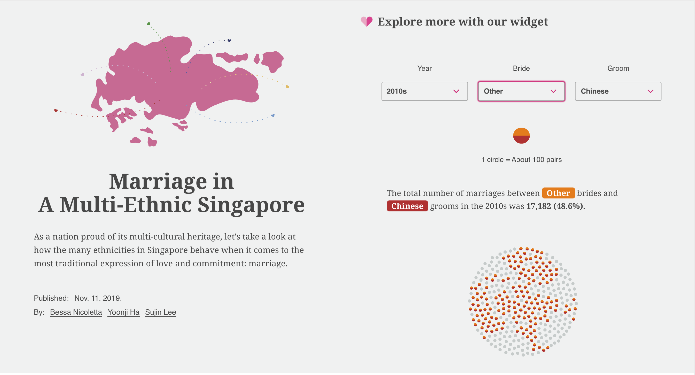
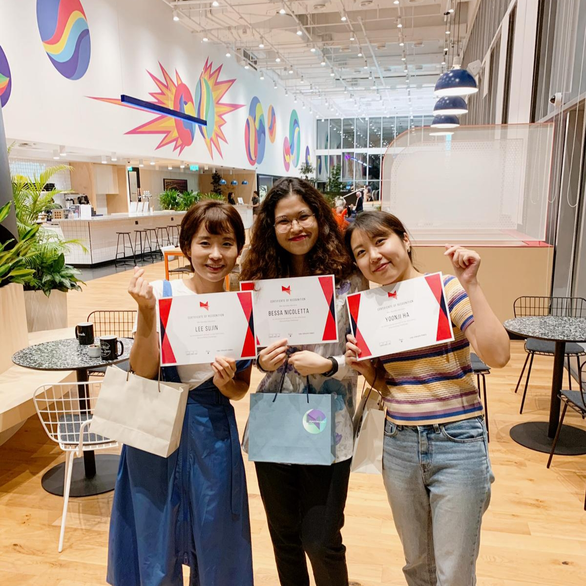

# Marriage in A Multi-Ethnic Singapore

💗 Link: http://sg-int-marriage.herokuapp.com/

📅 Published: Nov. 11. 2019.

🖍 By: [Bessa Nicoletta](https://www.linkedin.com/in/bessa-nicoletta-69442638/), [Yoonji Ha](https://www.linkedin.com/in/yoonjiha/), [Sujin Lee](https://www.linkedin.com/in/leesujin/)

---

## 2nd Prize of XDS Data Vis Storytelling Challenge 🥈

This data visualisation storytelling project won the second prize among 15 entries in the [2019 A Data Storytelling Challenge](https://www.xds.humancentreddata.science/) hosted by [Experimental Data Science Singapore](https://www.meetup.com/ko-KR/Experimental_Data_Science/).

### The excerpt from notes from judges

- Classic use of scrolly-telling, clean and visually pleasing.
- Technically strong.
- Very good link between visual language and the topic.
- Strong narrative and creative use of visual 'anchor' to support that narrative. Aesthetically consistent.
- Although the dot charts have been done before, it works very well in this context and your execution is good.
- The detail on e.g. mixed marriages in the dot chart is appreciated! Very creative way of showing this - half colored balls.
- Ability to explore data at the end is most successful amongst all entrants.
  Chart with the median age is strong.

---

## Development

- Install dependencies with `npm install` and Run `npm run start`.
